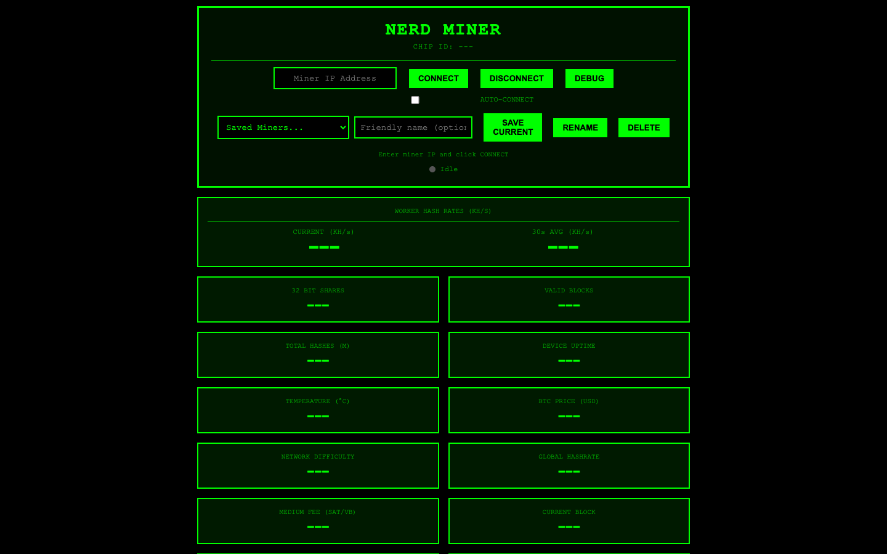
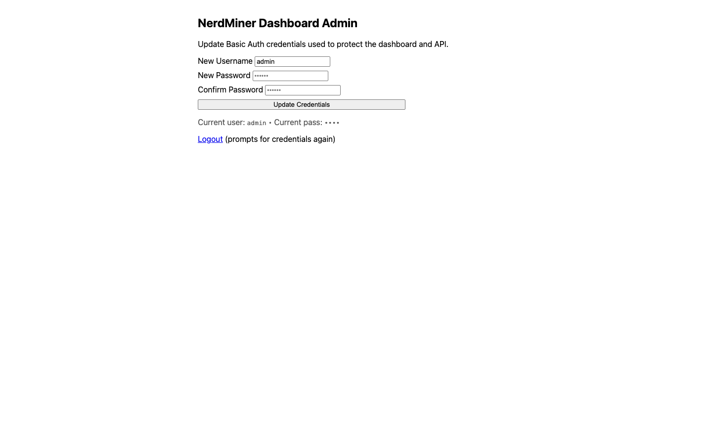

# NerdMiner WeAct Build

A fork of [NerdMiner_v2](https://github.com/BitMaker-hub/NerdMiner_v2) optimized for ESP32 WeAct boards with a custom web dashboard and secure remote access.

## Quick Start

### 1. Flash Firmware
```bash
pio run -t upload
```

### 2. Run Dashboard (Local)
```bash
cd web && python3 -m http.server 8000
```
Open `http://localhost:8000/nerdminer-dashboard.html`

### 3. Run Dashboard (Remote Access)
```bash
npm install
cp .env.example .env
# Edit .env: set MINER_IP, DASH_USER, DASH_PASS
npm start
```
Open `http://localhost:8080/?mode=proxy`

## Screenshots

### Main Dashboard
*Real-time mining statistics with current and 30-second average hash rates*



### Admin Panel
*Secure credential management interface*



> **Note:** To capture screenshots, run `./tools/capture-screenshots.sh` or see [docs/images/README.md](docs/images/README.md) for manual instructions.

## Features

**Hardware**
- ESP32 WeAct 0.96" OLED (GPIO 0 button, GPIO 22 LED)
- 3 mining workers with hardware SHA-256 acceleration
- ~350-420 KH/s hash rate
- Thermal throttling at 75°C

**Firmware**
- Aggressive optimizations (`-Ofast`, vectorization, unrolled loops)
- 240MHz dual-core operation
- 30-second rolling average hash rate

**Dashboard**
- 20+ real-time metrics (hash rate, temp, BTC price, difficulty, pool)
- Current + 30s average hash rate display
- Connection health indicator
- Debug panel with raw JSON
- Auto-reconnect and responsive UI

**Secure Remote Access**
- Node.js proxy with optional Basic Auth
- Admin UI for credential management (`/admin`)
- ngrok support for public URLs
- Secrets never committed (`.env` ignored)

## Remote Access Setup

### Requirements
- Node.js: `brew install node`
- ngrok (optional): `brew install ngrok`

### Configuration
1. Install dependencies:
   ```bash
   npm install
   ```

2. Configure environment:
   ```bash
   cp .env.example .env
   ```
   Edit `.env`:
   ```
   MINER_IP=192.168.0.185
   DASH_USER=admin
   DASH_PASS=nerd
   PORT=8080
   ```

3. Start proxy:
   ```bash
   npm start
   ```

4. (Optional) Expose publicly:
   ```bash
   ngrok config add-authtoken <YOUR_TOKEN>
   ngrok http 8080
   ```
   Share: `https://<subdomain>.ngrok-free.dev/?mode=proxy`

### Managing Credentials
- Change at runtime: visit `/admin` (persists to `.env`)
- Force re-auth: visit `/logout`

### Troubleshooting
- **WiFiManager instead of stats**: Use `?mode=proxy` in URL
- **No data**: Verify miner IP with `curl http://<MINER_IP>/api/stats`
- **IP changed**: Update `MINER_IP` in `.env` and restart proxy

## API Reference

### GET /api/stats
Returns JSON with 20+ fields:
```json
{
  "hashrate": 360.81,
  "avghashrate": 358.45,
  "workers": [98.4, 65.6, 98.4],
  "temp": 67.2,
  "btcprice": 92677,
  "currentblock": "925566",
  "globalhash": "1071 EH/s",
  "difficulty": "149.30T",
  "pool": "pool.tazmining.ch:33333",
  "uptime": "0d 00:00:35",
  "shares": 0,
  "valids": 0,
  "blocks": 0,
  "bestdiff": "0.014",
  "templates": 4,
  "mhashes": 6,
  "time": "16:27:41",
  "mediumfee": 3,
  "halving": 124434,
  "chipid": "80C426E81F84",
  "netok": 1
}
```

## Technical Details

**Build Stats**
- Flash: 37.9% (1,192,309 bytes)
- RAM: 16.9% (55,216 bytes)

**Optimization Flags**
- `-Ofast`, `-funroll-loops`, `-ffast-math`
- `-ftree-vectorize`, `-fvect-cost-model=unlimited`
- `-fipa-pta`, `-fomit-frame-pointer`
- PSRAM cache fixes for stability

## Credits

Fork of [NerdMiner_v2](https://github.com/BitMaker-hub/NerdMiner_v2) by BitMaker-hub.

**This Fork Adds**
- 30s rolling average hash rate
- Thermal throttling (75°C)
- Secure proxy server with Basic Auth
- Admin credential management UI
- Enhanced dashboard with 20+ API fields
- ngrok integration for public access

**Original Project Features**
- Multiple ESP32 board support
- Stratum V1 mining protocol
- WiFi configuration portal
- OLED/TFT display support

## License

Follows the same license as the original NerdMiner_v2 project.
